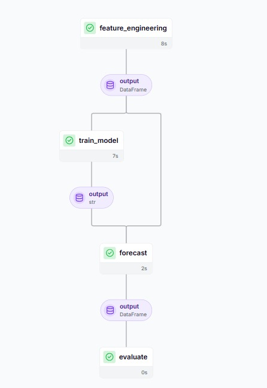
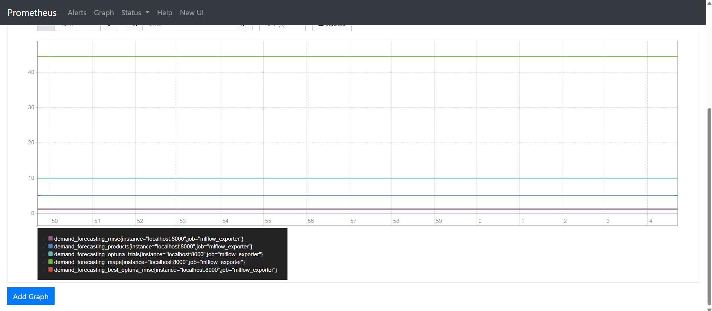
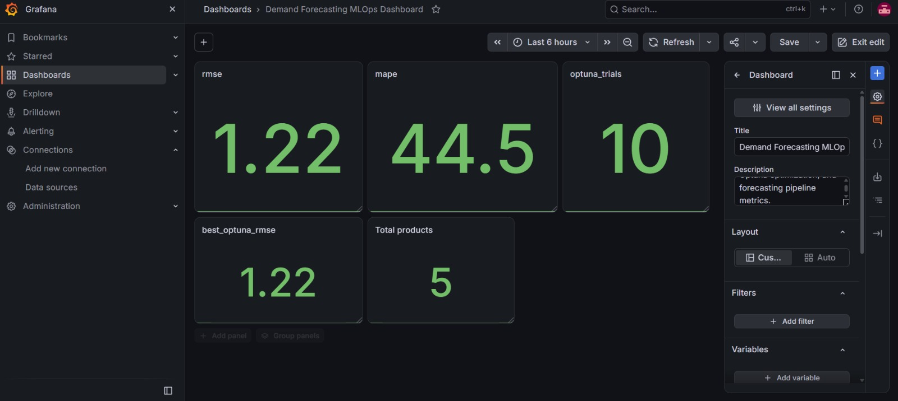

```{r setup, include=FALSE}
knitr::opts_chunk$set(
  echo = TRUE,
  warning = FALSE,
  message = FALSE,
  fig.align = "center",
  fig.pos = "H",
  out.width = "90%"
)

# Set project working directory
setwd("C:/Users/Test/Documents/GitHub/demand-forecasting-mlops")

# Required packages
library(knitr)
library(kableExtra)
```
# Problem Statement and Objectives

## Problem Statement

Demand forecasting is an important task in retail and e-commerce because accurate demand predictions help businesses improve inventory planning, reduce the risk of overstocking or stockouts, and support better operational decision-making.

This project focuses on developing an end-to-end machine learning-based demand forecasting system using the M5 Forecasting – Accuracy dataset. The dataset contains hierarchical daily sales information from Walmart. The project uses historical sales data to identify demand patterns and generate forecasts for selected products.

A major challenge in demand forecasting is that sales demand varies over time and may exhibit temporal patterns. Therefore, simply using historical sales values may not be sufficient. The proposed system performs time-series feature engineering using lag and rolling features so that the forecasting model can learn from previous demand observations and recent demand trends.

The project also incorporates MLOps practices to make the machine learning workflow reproducible, trackable, and easier to monitor. The pipeline integrates LightGBM for demand forecasting, Optuna for hyperparameter optimization, ZenML for pipeline orchestration, and MLflow for experiment tracking. In addition, Prometheus and Grafana are used for monitoring important model and pipeline metrics.

The overall problem addressed by this project is:

> To develop a reproducible and monitored demand forecasting pipeline that uses historical retail sales data, time-series features, and machine learning to generate accurate demand forecasts while applying MLOps practices for experiment tracking, optimization, orchestration, and monitoring.

## Objectives

The primary objective of this project is to develop an end-to-end demand forecasting pipeline using the M5 retail sales dataset and apply MLOps practices throughout the machine learning workflow.

The specific objectives are:

1. To preprocess and prepare historical retail sales data for demand forecasting.

2. To perform time-series feature engineering by generating lag and rolling features from historical demand observations.

3. To develop a demand forecasting model using LightGBM, a gradient-boosting machine learning algorithm.

4. To optimize the LightGBM hyperparameters using Optuna and identify a suitable configuration based on the forecasting evaluation metric.

5. To generate demand forecasts for five selected products from the M5 dataset.

6. To evaluate the forecasting performance using metrics such as Root Mean Squared Error (RMSE) and Mean Absolute Percentage Error (MAPE).

7. To use ZenML for pipeline orchestration, providing a structured and reproducible workflow for the different stages of the forecasting process.

8. To use MLflow for experiment tracking, including model parameters and evaluation metrics.

9. To implement Prometheus-based monitoring for important forecasting and model-performance metrics.

10. To visualize the monitored metrics using Grafana, providing a dashboard for observing the forecasting system.

11. To maintain the complete project using GitHub for version control and project collaboration. 


# M5 Dataset

## Dataset Description

The project uses the M5 Forecasting – Accuracy dataset for developing the demand forecasting model. The dataset contains hierarchical daily sales information from Walmart and is designed for forecasting product demand over time.

The dataset provides historical sales information along with calendar and product pricing information. These data sources are used together to construct the input required by the forecasting pipeline.

The main dataset files used in the project are calendar.csv, sales_train_evaluation.csv, and sell_prices.csv. The files are stored in the data directory of the project.

## Dataset Components

The calendar.csv file contains information related to the dates in the dataset, including calendar events and other date-related attributes. This information can be used to capture temporal patterns that may influence product demand.

The sales_train_evaluation.csv file contains the historical daily sales observations for individual products and stores. This dataset forms the primary source of demand information used for model development.

The sell_prices.csv file contains product pricing information for different stores and weeks. Pricing information can provide additional context about changes in product demand.

The relationship between these data sources provides the foundation for preparing the data for time-series demand forecasting.

## Dataset Used in the Project

The complete M5 dataset contains a large number of products and historical observations. To make the forecasting workflow computationally manageable for this project, the implementation was configured to forecast demand for five selected products.

The selected data are processed through the feature engineering stage before being passed to the forecasting model. Historical demand observations are transformed into time-series features, including lag and rolling features, which are subsequently used by the LightGBM model.

## Dataset Processing Flow

The dataset preparation follows the sequence shown below:

```text
M5 Sales Data
      |
      v
Data Loading
      |
      v
Data Preparation
      |
      v
Selection of Five Products
      |
      v
Time-Series Feature Engineering
      |
      v
Model Training Dataset
```

## Dataset Structure

The following table summarizes the primary files used in the project.

```{r dataset-table, echo=FALSE}
dataset_info <- data.frame(
  File = c(
    "calendar.csv",
    "sales_train_evaluation.csv",
    "sell_prices.csv"
  ),
  Purpose = c(
    "Provides calendar and date-related information",
    "Provides historical daily sales observations",
    "Provides product pricing information by store and week"
  )
)

knitr::kable(
  dataset_info,
  caption = "M5 dataset files used in the project",
  align = c("l", "l")
)
```

## Product Selection

The forecasting workflow was configured to generate demand forecasts for five selected products from the M5 dataset. Limiting the initial forecasting experiment to a defined set of products makes it possible to develop, evaluate, and monitor the complete MLOps workflow within the available computational resources.

The selected product data are passed through the same preprocessing, feature engineering, training, forecasting, and evaluation stages. This allows the complete pipeline to be demonstrated while maintaining a manageable experimental workload.


# Project Architecture

## System Architecture

The proposed system follows an end-to-end MLOps architecture in which data preparation, feature engineering, model development, forecasting, evaluation, experiment tracking, and monitoring are integrated into a structured workflow.

The architecture is designed around the demand forecasting pipeline developed using the M5 retail sales dataset. ZenML is used to organize and orchestrate the major stages of the machine learning workflow, while MLflow is used for experiment tracking. Prometheus collects monitoring metrics generated by the forecasting system, and Grafana provides a visual dashboard for monitoring these metrics.

The overall architecture of the proposed system is shown below.

```text
                         M5 DATASET
                             |
              +--------------+--------------+
              |              |              |
          Calendar       Sales Data     Sell Prices
              |              |              |
              +--------------+--------------+
                             |
                             v
                    DATA PREPARATION
                             |
                             v
                  FEATURE ENGINEERING
                  (Lag & Rolling Features)
                             |
                             v
                    ZENML PIPELINE
                             |
                    +--------+--------+
                    |                 |
                    v                 v
              MODEL TRAINING     OPTUNA
                    |          Hyperparameter
                    |          Optimization
                    +--------+--------+
                             |
                             v
                       LIGHTGBM MODEL
                             |
                             v
                       FORECASTING
                             |
                             v
                        EVALUATION
                       /           \
                    RMSE           MAPE
                       \           /
                        +---------+
                             |
                             v
                     MLflow Tracking
                             |
             +---------------+---------------+
             |                               |
             v                               v
       Model Parameters                Evaluation Metrics
                                             |
                                             v
                                  Prometheus Monitoring
                                             |
                                             v
                                      Grafana Dashboard
```

## Architecture Components

### Data Layer

The data layer consists of the M5 Forecasting – Accuracy dataset. The project uses historical sales data together with calendar and pricing information as the input for the forecasting workflow.

The three primary data sources are calendar data, sales data, and sell-price data. These sources are prepared before the feature engineering stage.

### Feature Engineering Layer

The feature engineering stage transforms the historical sales data into time-series features suitable for machine learning.

Lag features provide information about previous demand observations, while rolling features capture trends and statistics calculated from previous observations. These engineered features are used as inputs to the forecasting model.

### Model Training Layer

The model training stage uses LightGBM as the primary demand forecasting algorithm. LightGBM is trained using the engineered time-series features.

Optuna is integrated into the model development process to perform hyperparameter optimization. Multiple parameter configurations are evaluated, and the optimization process identifies a suitable configuration based on the selected evaluation objective.

### Forecasting and Evaluation Layer

After model training, the trained LightGBM model is used to generate demand forecasts for the selected five products.

The predictions are evaluated against the actual demand values using RMSE and MAPE. These metrics provide quantitative measures of forecasting performance.

### Pipeline Orchestration Layer

ZenML is used to organize the different stages of the machine learning workflow into a reproducible pipeline.

The major pipeline stages include feature engineering, model training, forecasting, and evaluation. This provides a structured execution flow and makes the machine learning workflow easier to reproduce and manage.

### Experiment Tracking Layer

MLflow is used to track experiments and record important information generated during model development.

The tracking layer includes model parameters and evaluation metrics such as RMSE and MAPE. This allows different model experiments and their results to be compared.

### Monitoring Layer

Prometheus is used to collect and expose monitoring metrics generated by the forecasting system. The project exposes metrics related to forecasting performance, product counts, Optuna trials, RMSE, MAPE, and the best Optuna RMSE.

These metrics are made available to Prometheus through the MLflow exporter component.

Grafana connects to Prometheus and provides a dashboard for visualizing the collected metrics. This allows the performance and operational state of the forecasting workflow to be monitored through graphical panels.

## End-to-End Workflow

The complete project workflow can be summarized as follows:

```text
M5 Dataset
     |
     v
Data Preparation
     |
     v
Feature Engineering
     |
     v
ZenML Pipeline
     |
     +--------------------+
     |                    |
     v                    v
LightGBM Training      Optuna
     |               Optimization
     +--------+-----------+
              |
              v
         Forecasting
              |
              v
          Evaluation
          /        \
       RMSE        MAPE
          \        /
           \      /
          MLflow
        Experiment
         Tracking
              |
              v
        MLflow Exporter
              |
              v
         Prometheus
              |
              v
          Grafana
         Dashboard
```

The architecture therefore combines machine learning development with MLOps components to provide a complete workflow from data ingestion to model monitoring.


# Feature Engineering

## Overview

Feature engineering is an important stage of the demand forecasting pipeline because machine learning models cannot directly interpret the sequential nature of raw sales observations. The historical sales data is therefore transformed into time-series features that provide information about previous demand and recent demand trends.

In this project, lag features and rolling features are generated from historical sales observations. These features allow the LightGBM model to learn temporal patterns in product demand.

The feature engineering stage is implemented as a step within the ZenML pipeline and its output is passed to the model training stage.

## Lag Features

Lag features represent previous sales observations for the same product. They provide the forecasting model with information about demand at earlier points in time.

For example, a lag-1 feature represents the sales value from the previous day, while a lag-7 feature can represent the sales value from seven days earlier. Such features can help the model identify short-term and weekly demand patterns.

The general form of a lag feature is:

\[
Lag_k(t) = y_{t-k}
\]

where \(y_t\) represents the demand at time \(t\), and \(k\) represents the number of time steps by which the demand is shifted.

For example:

```text
Current Day       Previous Day       Previous Week
    |                  |                  |
    v                  v                  v
 Demand(t)         Demand(t-1)        Demand(t-7)
                       |                  |
                       +------------------+
                                |
                                v
                       Model Input Features
```

## Rolling Features

Rolling features summarize demand observations over a specified historical window. They help capture local demand trends and smooth short-term fluctuations.

A rolling mean can be represented as:

\[
RollingMean_w(t) =
\frac{1}{w}
\sum_{i=1}^{w} y_{t-i}
\]

where \(w\) represents the size of the historical window.

For example, a seven-day rolling mean summarizes demand over the previous seven observations and can provide the model with information about the recent demand trend.

Rolling features can therefore complement lag features by providing aggregated information rather than relying only on individual historical observations.

## Feature Engineering Process

The feature engineering process used in the project can be summarized as follows:

```text
Historical Sales Data
          |
          v
     Sort by Time
          |
          v
   Group Product Data
          |
          v
    Generate Lag Features
          |
          v
  Generate Rolling Features
          |
          v
 Remove Invalid/Initial Rows
          |
          v
 Engineered Feature Dataset
          |
          v
      LightGBM Model
```

## Python Implementation

The following code demonstrates the feature engineering approach used in the forecasting workflow.

```{python feature-engineering, echo=TRUE, eval=FALSE}
import pandas as pd

# Sort the data chronologically
df = df.sort_values(["id", "date"])

# Create lag features
df["lag_1"] = df.groupby("id")["sales"].shift(1)
df["lag_7"] = df.groupby("id")["sales"].shift(7)

# Create rolling features using previous observations
df["rolling_mean_7"] = (
    df.groupby("id")["sales"]
      .shift(1)
      .rolling(7)
      .mean()
      .reset_index(level=0, drop=True)
)

df["rolling_mean_28"] = (
    df.groupby("id")["sales"]
      .shift(1)
      .rolling(28)
      .mean()
      .reset_index(level=0, drop=True)
)

# Remove rows containing missing values created by lagging
df = df.dropna()
```

The `shift()` operation creates lagged observations, while the rolling mean calculates the average demand over a historical window. The use of previous observations prevents information from the current or future period from being used to construct the forecasting features.

The exact feature set used by the project is determined by the implementation in the feature engineering step and is subsequently passed to the LightGBM training stage.

## Importance of Feature Engineering

The generated features provide the forecasting model with historical context that is not available from the raw sales value alone. Lag features allow the model to identify relationships with previous observations, while rolling features help capture recent demand trends.

This transformation is particularly important for time-series forecasting because the order of observations contains useful information. By incorporating historical demand patterns into the model inputs, the LightGBM model can learn relationships between previous demand and future demand.

The resulting engineered dataset forms the input to the model training stage of the MLOps pipeline.


# LightGBM

## Model Overview

LightGBM is a gradient boosting framework based on decision tree algorithms. In this project, LightGBM is used as the primary machine learning model for demand forecasting.

The model receives the engineered time-series features as input and learns the relationship between historical demand patterns and the target sales value. The trained model is then used to generate demand forecasts for the five selected products.

LightGBM is suitable for this project because the feature engineering stage produces a tabular dataset containing lag and rolling features. The model can learn nonlinear relationships between these features and the target demand.

## Role of LightGBM in the Pipeline

The LightGBM model is positioned after the feature engineering stage and before forecasting and evaluation.

```text
Engineered Features
        |
        v
+------------------+
|     LightGBM     |
|  Gradient Boost  |
|   Decision Trees |
+--------+---------+
         |
         v
 Predicted Demand
         |
         v
    Evaluation
    /        \
  RMSE      MAPE
```

The model development process consists of preparing the engineered features, separating the input features from the target variable, training the LightGBM model, generating predictions, and evaluating the resulting forecasts.

## Model Training

During training, the engineered historical features are provided to LightGBM along with the corresponding target demand values.

The general training process can be represented as:

```text
Engineered Dataset
        |
        +------------------+
        |                  |
        v                  v
Input Features          Target
        |                  |
        +--------+---------+
                 |
                 v
          LightGBM Training
                 |
                 v
           Trained Model
                 |
                 v
          Demand Prediction
```

The trained forecasting model is saved as a serialized model file:

```text
models/forecast_model.pkl
```

This allows the trained model to be reused for generating predictions without requiring the complete training process to be repeated.

## Python Implementation

The following code illustrates the LightGBM model training process used in the project.

```{python lightgbm-training, echo=TRUE, eval=FALSE}
import lightgbm as lgb

# Separate input features and target
X = df[feature_columns]
y = df["sales"]

# Create the LightGBM model
model = lgb.LGBMRegressor(
    objective="regression",
    n_estimators=100,
    learning_rate=0.05
)

# Train the model
model.fit(X, y)

# Generate predictions
predictions = model.predict(X)
```

The actual model configuration used during the project is determined by the hyperparameter optimization stage. The example above illustrates the structure of the training process rather than replacing the optimized configuration.

## Hyperparameters

LightGBM contains several parameters that influence model performance. Important parameters include the learning rate, number of estimators, tree complexity, and other parameters controlling the behavior of the gradient boosting process.

Selecting appropriate values for these parameters is important because an unsuitable configuration can lead to underfitting or overfitting.

In this project, the hyperparameter selection process is supported by Optuna. Instead of relying only on manually selected values, multiple configurations are evaluated and the configuration producing a better validation RMSE is selected.

The relationship between LightGBM and Optuna is therefore:

```text
                Optuna
                   |
          Hyperparameter Trial
                   |
                   v
              LightGBM
                   |
                   v
             Validation
                   |
                   v
                 RMSE
                   |
                   v
        Optuna selects better
        hyperparameter values
```

## Forecast Generation

After the model has been trained using the engineered historical data, the trained LightGBM model is used to generate demand predictions.

The forecasting stage produces predicted demand values for the five selected products. These predictions are subsequently passed to the evaluation stage, where they are compared with the actual demand values.

## Model Output

The main output of the LightGBM stage is a trained forecasting model and its corresponding demand predictions.

The model output is subsequently used by the evaluation stage to calculate RMSE and MAPE. The model parameters and evaluation results are also tracked through MLflow as part of the MLOps workflow.

The next stage of the project uses Optuna to optimize the LightGBM hyperparameters and identify a suitable model configuration.


# Optuna Hyperparameter Optimization

## Overview

Optuna is used in the project to optimize the hyperparameters of the LightGBM demand forecasting model. Hyperparameters control how the model learns from the training data and can have a significant effect on forecasting performance.

Instead of manually selecting a single set of hyperparameter values, Optuna evaluates multiple configurations through a sequence of optimization trials. Each trial trains the forecasting model using a particular combination of hyperparameters and evaluates its performance using the validation RMSE.

The objective of the optimization process is to identify a hyperparameter configuration that minimizes the validation RMSE.

## Optimization Process

The Optuna optimization process used in the project can be summarized as follows:

```text
Define Hyperparameter Search Space
              |
              v
       Create Optuna Trial
              |
              v
      Select Hyperparameters
              |
              v
        Train LightGBM
              |
              v
       Generate Predictions
              |
              v
       Calculate Validation RMSE
              |
              v
       Record Trial Result
              |
              v
       Repeat for Multiple Trials
              |
              v
       Select Best Trial
```

Each trial represents one candidate LightGBM configuration. The validation RMSE obtained from the trial is used as the objective value for optimization.

Since RMSE is minimized in this project, a trial with a lower RMSE represents a better-performing configuration.

## Hyperparameter Optimization

The optimization process can be represented mathematically as:

\[
\theta^* = \arg\min_{\theta \in \Theta} RMSE(\theta)
\]

where \(\theta\) represents a candidate set of LightGBM hyperparameters, \(\Theta\) represents the defined search space, and \(\theta^*\) represents the configuration that produces the minimum validation RMSE.

The optimization process helps identify a suitable LightGBM configuration without requiring every possible combination of hyperparameters to be evaluated manually.

## Python Implementation

The following code illustrates the Optuna optimization approach used in the project.

```{python optuna, echo=TRUE, eval=FALSE}
import optuna
import lightgbm as lgb
from sklearn.metrics import mean_squared_error
import numpy as np

def objective(trial):

    params = {
        "learning_rate": trial.suggest_float(
            "learning_rate", 0.01, 0.2
        ),
        "n_estimators": trial.suggest_int(
            "n_estimators", 50, 300
        ),
        "num_leaves": trial.suggest_int(
            "num_leaves", 10, 100
        )
    }

    model = lgb.LGBMRegressor(
        objective="regression",
        **params
    )

    model.fit(X_train, y_train)

    predictions = model.predict(X_valid)

    rmse = np.sqrt(
        mean_squared_error(y_valid, predictions)
    )

    return rmse


study = optuna.create_study(direction="minimize")
study.optimize(objective, n_trials=10)

best_params = study.best_params
best_rmse = study.best_value
```

The code demonstrates the basic optimization process in which Optuna proposes hyperparameter values, LightGBM is trained using those values, and the resulting validation RMSE is returned to Optuna.

The actual search space and model configuration used by the project are determined by the implementation in the training step.

## Optuna Trial Results

The optimization experiment produced multiple trials, with each trial corresponding to a different hyperparameter configuration.

The trial results provide information about how the selected hyperparameters affected forecasting performance.

```{r optuna-trials, echo=FALSE, out.width="95%", fig.align="center"}
knitr::include_graphics("images/optuna_trials.jpeg")
```

Figure: Optuna trial results from the demand forecasting experiment.

The trial results demonstrate that different hyperparameter configurations produce different RMSE values. The optimization process therefore provides a systematic approach for comparing candidate model configurations.

## Hyperparameter Comparison

The relationship between the learning rate and trial RMSE was also visualized to examine the effect of the hyperparameter on model performance.

```{r optuna-comparison, echo=FALSE, out.width="95%", fig.align="center"}
knitr::include_graphics("images/Optuna_Comparison_Plot.png")
```

Figure: Comparison of learning rate and trial RMSE across Optuna trials.

The comparison plot provides a visual representation of the performance obtained from the different optimization trials. Lower RMSE values indicate better forecasting performance for the corresponding trial.

The plot can therefore be used to identify regions of the hyperparameter search space associated with better validation performance.

## Best Optuna Result

The most important output from Optuna is the best trial. The best trial contains the hyperparameter configuration that achieved the lowest validation RMSE among the evaluated trials.

The best configuration is then used in the subsequent model training and forecasting workflow.

The optimization process should therefore be understood as a model-selection step rather than a forecasting step. Optuna does not directly generate the final demand forecast. Instead, it identifies a suitable LightGBM configuration, which is subsequently used to train the forecasting model.

## Role of Optuna in the MLOps Workflow

Optuna contributes to the model development stage of the overall MLOps workflow.

```text
Feature Engineering
        |
        v
      Optuna
        |
        +----------------------+
        |                      |
        v                      v
Hyperparameter Trial      LightGBM Model
        |                      |
        +----------+-----------+
                   |
                   v
              Validation
                   |
                   v
                 RMSE
                   |
                   v
             Best Trial
                   |
                   v
          Final Model Training
```

The optimized model parameters and resulting evaluation metrics are subsequently tracked using MLflow, allowing the optimization experiments to be recorded and compared.


# RMSE and MAPE

## Overview

The performance of the demand forecasting model is evaluated using Root Mean Squared Error (RMSE) and Mean Absolute Percentage Error (MAPE). These metrics compare the actual demand values with the demand values predicted by the LightGBM model.

RMSE measures the magnitude of prediction errors in the scale of the target variable, while MAPE expresses the forecasting error as a percentage.

Using both metrics provides a broader view of the forecasting performance because they represent prediction error from different perspectives.

## Root Mean Squared Error

Root Mean Squared Error is calculated using the following formula:

\[
RMSE =
\sqrt{
\frac{1}{n}
\sum_{i=1}^{n}
(y_i-\hat{y}_i)^2
}
\]

where:

- \(n\) represents the total number of observations being evaluated.
- \(y_i\) represents the actual demand for observation \(i\).
- \(\hat{y}_i\) represents the demand predicted by the LightGBM model for observation \(i\).
- \(y_i-\hat{y}_i\) represents the prediction error.
- The squared errors are averaged and the square root is taken to obtain the RMSE.

In this project, RMSE measures how closely the predicted demand values match the actual demand values for the selected products.

A lower RMSE indicates that the predicted demand is closer to the actual demand, assuming the models are evaluated using the same dataset and evaluation procedure.

## Mean Absolute Percentage Error

Mean Absolute Percentage Error is calculated as:

\[
MAPE =
\frac{100}{n}
\sum_{i=1}^{n}
\left|
\frac{y_i-\hat{y}_i}{y_i}
\right|
\]

where:

- \(n\) represents the total number of observations.
- \(y_i\) represents the actual demand.
- \(\hat{y}_i\) represents the predicted demand.
- The absolute difference between actual and predicted demand is divided by the actual demand.
- Multiplication by 100 converts the result into a percentage.

In this project, MAPE indicates the average percentage difference between the actual demand and the forecasted demand.

A lower MAPE generally indicates better forecasting accuracy.

## Evaluation Process

The evaluation stage compares the actual demand values with the predictions generated by the trained LightGBM model.

The process can be represented as:

```text
Actual Demand
      |
      +----------------+
      |                |
      v                v
Predicted Demand   LightGBM Output
      |                |
      +-------+--------+
              |
              v
       Calculate Errors
              |
       +------+------+
       |             |
       v             v
      RMSE          MAPE
       |             |
       +------+------+
              |
              v
       Model Evaluation
```

The evaluation metrics are subsequently logged in MLflow and exposed through the monitoring layer.

## Python Implementation

The following code demonstrates the calculation of RMSE and MAPE from actual and predicted demand values.

```{python evaluation-metrics, echo=TRUE, eval=FALSE}
import numpy as np
from sklearn.metrics import mean_squared_error

# Actual and predicted demand
actual = y_test
predicted = model.predict(X_test)

# RMSE
rmse = np.sqrt(
    mean_squared_error(actual, predicted)
)

# MAPE
mape = np.mean(
    np.abs((actual - predicted) / actual)
) * 100

print("RMSE:", rmse)
print("MAPE:", mape)
```

The calculation is performed after the forecasting stage. The resulting metrics provide the quantitative evaluation of the trained demand forecasting model.

## Project Results

The final experiment recorded the following evaluation results:

```{r evaluation-results, echo=FALSE}
evaluation_results <- data.frame(
  Metric = c("RMSE", "MAPE"),
  Value = c("1.2253", "46.29%")
)

knitr::kable(
  evaluation_results,
  caption = "Final demand forecasting evaluation results",
  align = c("l", "c")
)
```

The recorded RMSE was 1.2253, indicating the magnitude of the forecasting error in the scale of the demand variable used by the model.

The recorded MAPE was 46.29%, indicating the average percentage error between the actual and predicted demand values for the evaluated observations.

These values represent the final recorded experiment used in the project and are subsequently available through the MLflow experiment tracking and monitoring components.

## Interpretation

RMSE and MAPE provide complementary information about the model.

RMSE focuses on the magnitude of prediction errors and gives greater influence to larger errors because the errors are squared before averaging. This makes RMSE useful for identifying whether the model has relatively large prediction deviations.

MAPE expresses the error in percentage terms, making it easier to interpret the average forecasting error relative to the actual demand.

Therefore, the two metrics are used together in this project to evaluate the performance of the LightGBM forecasting model.

## Role in the MLOps Workflow

The evaluation metrics are not only used for assessing the model during development. They are also incorporated into the MLOps monitoring workflow.

The evaluation and monitoring flow is:

```text
LightGBM Predictions
        |
        v
   Actual vs Predicted
        |
        +-------------+
        |             |
        v             v
      RMSE           MAPE
        |             |
        +------+------+
               |
               v
             MLflow
               |
               v
       MLflow Exporter
               |
               v
          Prometheus
               |
               v
            Grafana
```

This allows the model evaluation results to be tracked during experimentation and subsequently exposed as monitoring metrics for visualization.


# ZenML Pipeline

## Overview

ZenML is used in the project to organize the demand forecasting workflow into a structured and reproducible machine learning pipeline. Instead of executing the different stages independently, the workflow is divided into individual pipeline steps that are executed in a defined sequence.

The main stages of the forecasting workflow are feature engineering, model training, forecasting, and evaluation. Each stage performs a specific task and passes its output to the subsequent stage.

## Pipeline Architecture

The ZenML pipeline used in the project follows the sequence:

```text
M5 Dataset
     |
     v
Feature Engineering
     |
     v
Model Training
     |
     v
Forecasting
     |
     v
Evaluation
     |
     v
RMSE and MAPE
```

The pipeline provides a structured connection between the different components of the demand forecasting system.

## Pipeline Steps

### Feature Engineering

The first pipeline step prepares the historical sales data and generates the time-series features required by the forecasting model. Lag and rolling features are created from historical demand observations.

### Model Training

The model training step uses the engineered features to train the LightGBM forecasting model. Optuna is used during the model development process to identify a suitable hyperparameter configuration.

### Forecasting

The forecasting step uses the trained model to generate predicted demand values for the selected five products.

### Evaluation

The evaluation step compares the predicted demand with the actual demand and calculates RMSE and MAPE. These metrics are used to measure the performance of the forecasting model.

## ZenML Pipeline Implementation

The pipeline is defined in:

```text
pipelines/forecast_pipeline.py
```

The individual processing steps are organized under:

```text
steps/
├── feature_engineering.py
├── train_model.py
├── forecast.py
└── evaluate.py
```

This organization separates the individual stages of the machine learning workflow and makes the pipeline easier to maintain.

## Pipeline Execution

The complete pipeline is executed through the project workflow. The execution connects the output of one stage to the input of the next stage.

The pipeline can be represented as:

```text
             ZenML Pipeline
                   |
                   v
       +-----------------------+
       | Feature Engineering   |
       +-----------+-----------+
                   |
                   v
       +-----------------------+
       | Model Training        |
       | LightGBM + Optuna     |
       +-----------+-----------+
                   |
                   v
       +-----------------------+
       | Forecasting           |
       | 5 Selected Products   |
       +-----------+-----------+
                   |
                   v
       +-----------------------+
       | Evaluation            |
       | RMSE + MAPE           |
       +-----------------------+
```

## ZenML Pipeline Output

The main purpose of ZenML in this project is workflow orchestration rather than model evaluation itself. The pipeline ensures that the major stages of the forecasting workflow are executed in the intended order.

The outputs of the pipeline include the trained forecasting model, demand predictions, and evaluation metrics. These outputs are subsequently used by the experiment tracking and monitoring components of the project.

## ZenML Pipeline Result

The executed ZenML pipeline is shown below.

```{r zenml-pipeline, echo=FALSE, out.width="95%", fig.align="center"}

```

Figure: ZenML pipeline execution for the demand forecasting workflow.

The pipeline visualization demonstrates the execution of the individual forecasting stages and their relationship within the overall workflow.

## Role of ZenML in the MLOps Workflow

ZenML provides the orchestration layer of the project. It connects the machine learning stages into a reproducible workflow while the other MLOps tools perform complementary functions.

The relationship between the main components can be summarized as:

```text
                 ZenML
          Pipeline Orchestration
                   |
       +-----------+-----------+
       |           |           |
       v           v           v
 Feature       Training     Evaluation
Engineering    + Optuna     RMSE + MAPE
       |           |           |
       +-----------+-----------+
                   |
                   v
                MLflow
          Experiment Tracking
                   |
                   v
              Prometheus
               Monitoring
                   |
                   v
                Grafana
             Visualization
```

Therefore, ZenML forms the workflow orchestration layer, while MLflow, Prometheus, and Grafana provide experiment tracking and monitoring capabilities around the forecasting pipeline.


# MLflow Experiment Tracking

## Overview

MLflow is used in the project for experiment tracking and management of the demand forecasting experiments. It records important information generated during model development, allowing different experiments to be monitored and compared.

The MLflow tracking component is integrated with the forecasting workflow so that model parameters and evaluation metrics can be recorded during experimentation.

The MLflow experiment used in the project is:

```text
demand_forecasting
```

## Role of MLflow

MLflow provides a centralized location for recording information associated with model experiments. In this project, the tracked information includes model parameters and evaluation metrics such as RMSE and MAPE.

The experiment tracking workflow can be represented as:

```text
Model Configuration
        |
        v
   Model Training
        |
        v
   Model Evaluation
        |
        +----------------+
        |                |
        v                v
      RMSE              MAPE
        |                |
        +--------+-------+
                 |
                 v
              MLflow
                 |
                 v
          Experiment Run
```

Each experiment run provides a record of the configuration and performance of the corresponding forecasting model.

## MLflow Experiment Runs

The MLflow interface was used to inspect and compare the forecasting experiments. Multiple runs were generated during the model development and hyperparameter optimization process.

The experiment interface provides information about individual runs and their associated parameters and metrics.

```{r mlflow-runs, echo=FALSE, out.width="95%", fig.align="center"}
knitr::include_graphics("images/mlflow1.jpeg")
```

Figure: MLflow experiment tracking interface.

The recorded runs allow the different model configurations to be reviewed and compared. This is useful for identifying experiments that produced better forecasting performance.

## Tracked Parameters and Metrics

The project records model-related information and evaluation results through MLflow. Important tracked values include model parameters, RMSE, MAPE, and information associated with the optimization trials.

The evaluation metrics provide a direct way to compare the performance of different experiments.

The relationship between the tracked information can be represented as:

```text
                  MLflow Run
                      |
          +-----------+-----------+
          |                       |
          v                       v
      Parameters              Metrics
          |                       |
          |                 +-----+-----+
          |                 |           |
          v                 v           v
  Model Configuration     RMSE        MAPE
```

## Experiment Comparison

MLflow can be used to compare the results of different experiments. The comparison view makes it possible to inspect how changes in model configuration affect forecasting performance.

```{r mlflow-comparison, echo=FALSE, out.width="95%", fig.align="center"}
knitr::include_graphics("images/mlflow2.jpeg")
```

Figure: MLflow comparison of forecasting experiments.

The experiment comparison provides a structured view of the different runs and their corresponding results. Lower RMSE values indicate better forecasting performance when the experiments are evaluated using the same validation procedure.

## MLflow Metrics

The tracked experiment metrics provide information about the performance of the forecasting model.

```{r mlflow-metrics, echo=FALSE, out.width="95%", fig.align="center"}
knitr::include_graphics("images/mlflow3.jpeg")
```

Figure: MLflow metrics recorded during the forecasting experiment.

The MLflow interface provides a convenient way to inspect the recorded model performance and experiment information without manually reviewing the output of individual pipeline executions.

## Integration with Optuna

MLflow and Optuna perform complementary roles in the project.

Optuna is responsible for searching the hyperparameter space and identifying promising LightGBM configurations, while MLflow records the results of the experiments.

The relationship can be summarized as:

```text
              Optuna
                 |
                 v
       Hyperparameter Trial
                 |
                 v
             LightGBM
                 |
                 v
          Model Evaluation
                 |
           +-----+-----+
           |           |
           v           v
         RMSE         MAPE
           |           |
           +-----+-----+
                 |
                 v
              MLflow
                 |
                 v
        Experiment Tracking
```

This integration allows the results of the optimization process to be retained as part of the overall experiment history.

## MLflow in the MLOps Architecture

MLflow forms the experiment tracking layer between model development and monitoring.

```text
M5 Dataset
     |
     v
Feature Engineering
     |
     v
LightGBM + Optuna
     |
     v
Forecasting
     |
     v
Evaluation
     |
     +------------+
     |            |
     v            v
    RMSE         MAPE
     |            |
     +------+-----+
            |
            v
          MLflow
            |
            v
     MLflow Exporter
            |
            v
       Prometheus
            |
            v
         Grafana
```

The integration of MLflow with the monitoring components allows important experiment metrics to be made available beyond the experiment tracking interface.

## Summary

MLflow provides experiment traceability throughout the demand forecasting workflow. It records the results of model experiments and allows different runs to be compared using their parameters and evaluation metrics.

In combination with Optuna, MLflow provides a structured record of the hyperparameter optimization experiments. The tracked metrics are subsequently used by the monitoring layer implemented with Prometheus and Grafana.


# Prometheus and Grafana Monitoring

## Overview

Monitoring is an important part of the MLOps workflow because it provides visibility into the performance of the forecasting system after model development and evaluation.

In this project, Prometheus and Grafana are used as the monitoring components. Prometheus collects metrics exposed by the MLflow exporter, while Grafana connects to Prometheus and presents the collected metrics through an interactive dashboard.

The monitoring architecture is:

```text
                    MLflow
                       |
                       v
              MLflow Exporter
                       |
                  /metrics
                       |
                       v
                 Prometheus
                       |
                       v
                  Grafana
                       |
                       v
              Monitoring Dashboard
```

## MLflow Exporter

The project includes an MLflow exporter located at:

```text
monitoring/mlflow_exporter.py
```

The exporter retrieves relevant experiment information and exposes selected metrics in a format that can be scraped by Prometheus.

The exporter acts as a bridge between MLflow and Prometheus because MLflow is primarily used for experiment tracking, while Prometheus is designed for collecting monitoring metrics.

The exporter therefore enables selected forecasting experiment results to become available to the monitoring system.

## Prometheus Configuration

The Prometheus configuration is maintained in:

```text
monitoring/prometheus/prometheus.yml
```

The configuration defines the monitoring target from which Prometheus collects metrics.

The monitoring process can be summarized as:

```text
MLflow Metrics
      |
      v
MLflow Exporter
      |
      | HTTP Metrics Endpoint
      v
Prometheus Scraping
      |
      v
Prometheus Time-Series Database
```

Prometheus was also used during project testing to verify that the MLflow exporter was reachable and that the required forecasting metrics were being collected successfully.

## Monitoring Metrics

The project exposes five important demand forecasting metrics through the monitoring system:

```text
demand_forecasting_best_optuna_rmse

demand_forecasting_mape

demand_forecasting_optuna_trials

demand_forecasting_products

demand_forecasting_rmse
```

These metrics represent different aspects of the forecasting experiment.

| Metric | Description |
|---|---|
| `demand_forecasting_best_optuna_rmse` | Best RMSE obtained during Optuna hyperparameter optimization |
| `demand_forecasting_mape` | Mean Absolute Percentage Error of the forecasting model |
| `demand_forecasting_optuna_trials` | Number of Optuna optimization trials |
| `demand_forecasting_products` | Number of products included in the forecasting workflow |
| `demand_forecasting_rmse` | RMSE of the forecasting model |

Together, these metrics provide a compact view of model performance and important characteristics of the forecasting experiment.

## PromQL Query

The five metrics can be queried together in Prometheus using the following PromQL expression:

```promql
{
  __name__=~"demand_forecasting_best_optuna_rmse|demand_forecasting_mape|demand_forecasting_optuna_trials|demand_forecasting_products|demand_forecasting_rmse"
}
```

This query uses a regular expression to select the five demand forecasting metrics simultaneously.

Although the metrics can be displayed together, they represent different quantities and have different numerical scales. Therefore, separate dashboard panels provide a clearer representation when monitoring them in Grafana.

## Prometheus Monitoring Result

The Prometheus interface was used to verify that the metrics exposed by the MLflow exporter were successfully collected.

```{r prometheus-result, echo=FALSE, out.width="95%", fig.align="center"}

```

Figure: Prometheus metrics collected from the MLflow exporter.

The monitoring result demonstrates that the forecasting metrics are available to Prometheus. The presence of the metrics confirms the connection between the MLflow exporter and Prometheus.

## Grafana

Grafana is used as the visualization layer of the monitoring system. It connects to Prometheus as a data source and displays the collected metrics through dashboard panels.

The Grafana dashboard provides a centralized view of the important metrics generated by the demand forecasting workflow.

The dashboard is stored in the project under:

```text
monitoring/grafana/
```

The dashboard configuration can therefore be version-controlled together with the rest of the project.

## Grafana Dashboard

The implemented Grafana dashboard provides visual representations of the monitoring metrics.

```{r grafana-result, echo=FALSE, out.width="95%", fig.align="center"}

```

Figure: Grafana dashboard for the demand forecasting MLOps system.

The dashboard provides a convenient way to inspect the forecasting metrics from a single interface. It includes information related to RMSE, MAPE, Optuna optimization, and the number of products used in the forecasting workflow.

## Monitoring Workflow

The complete monitoring workflow can be represented as:

```text
                  MLflow
                    |
                    v
             Experiment Metrics
                    |
                    v
            MLflow Exporter
                    |
                    v
              Prometheus
                    |
             +------+------+
             |             |
             v             v
        PromQL Query    Time Series
             |             |
             +------+------+
                    |
                    v
                 Grafana
                    |
                    v
          Monitoring Dashboard
```

This architecture separates experiment tracking from monitoring while allowing important metrics to flow from MLflow into the monitoring system.

## Role of Prometheus and Grafana in MLOps

Prometheus and Grafana extend the project beyond model development and experiment tracking.

Prometheus provides the metric collection layer, making the forecasting metrics available as time-series data. Grafana provides the visualization layer, allowing the metrics to be inspected through graphical dashboard panels.

The complete MLOps workflow can therefore be summarized as:

```text
M5 Dataset
     |
     v
Feature Engineering
     |
     v
LightGBM + Optuna
     |
     v
Forecasting
     |
     v
RMSE + MAPE
     |
     v
MLflow
     |
     v
MLflow Exporter
     |
     v
Prometheus
     |
     v
Grafana
```

The integration of these components provides an end-to-end workflow covering data preparation, model development, optimization, experiment tracking, evaluation, and monitoring.


# Results

## Overview

The developed demand forecasting system was executed as an end-to-end MLOps workflow covering feature engineering, model training, hyperparameter optimization, forecasting, evaluation, experiment tracking, pipeline orchestration, and monitoring.

The final results demonstrate the integration of the machine learning and MLOps components into a single workflow. The forecasting model was evaluated using RMSE and MAPE, while Optuna was used for hyperparameter optimization and MLflow was used to track the experiments. ZenML provided pipeline orchestration, and Prometheus and Grafana were used for monitoring.

## Forecasting Performance

The final experiment achieved the following evaluation results:

```{r final-results, echo=FALSE}
results <- data.frame(
  Metric = c("RMSE", "MAPE"),
  Result = c("1.2253", "46.29%")
)

knitr::kable(
  results,
  caption = "Final forecasting performance",
  align = c("l", "c")
)
```

The recorded RMSE was 1.2253. RMSE measures the magnitude of the difference between the actual demand values and the predicted demand values, with larger errors receiving greater influence because the errors are squared during calculation.

The recorded MAPE was 46.29%. MAPE expresses the average forecasting error as a percentage of the actual demand values.

These two metrics provide complementary information about the performance of the forecasting model. RMSE represents error in the scale of the target variable, while MAPE provides a percentage-based representation of forecasting error.

## Optuna Optimization Results

Optuna was used to evaluate multiple LightGBM hyperparameter configurations during model optimization. Each trial represented a candidate configuration and produced an associated validation RMSE.

The trial results are shown below.

```{r results-optuna-trials, echo=FALSE, out.width="95%", fig.align="center"}
knitr::include_graphics("images/optuna_trials.jpeg")
```

Figure: Optuna trial results.

The optimization results show that different hyperparameter configurations produced different RMSE values. The best configuration was selected based on the minimum validation RMSE among the evaluated trials.

The comparison between the learning rate and trial RMSE is shown below.

```{r results-optuna-comparison, echo=FALSE, out.width="95%", fig.align="center"}
knitr::include_graphics("images/Optuna_Comparison_Plot.png")
```

Figure: Comparison of learning rate and trial RMSE across Optuna trials.

The comparison plot provides a visual representation of the relationship between the selected learning rate values and the resulting trial RMSE values.

## MLflow Results

MLflow provided experiment tracking throughout the model development process. The recorded runs contain information about the model experiments and their corresponding evaluation metrics.

```{r results-mlflow, echo=FALSE, out.width="95%", fig.align="center"}
knitr::include_graphics("images/mlflow1.jpeg")
```

Figure: MLflow experiment tracking results.

The experiment comparison interface provides a way to inspect the performance of different model runs.

```{r results-mlflow-comparison, echo=FALSE, out.width="95%", fig.align="center"}
knitr::include_graphics("images/mlflow2.jpeg")
```

Figure: Comparison of MLflow experiment runs.

The tracked metrics provide a record of the forecasting experiments and support comparison between different model configurations.

```{r results-mlflow-metrics, echo=FALSE, out.width="95%", fig.align="center"}
knitr::include_graphics("images/mlflow3.jpeg")
```

Figure: MLflow metrics recorded for the forecasting experiments.

## ZenML Pipeline Result

The complete forecasting workflow was organized and executed using ZenML.

```{r results-zenml, echo=FALSE, out.width="95%", fig.align="center"}

```

Figure: Executed ZenML demand forecasting pipeline.

The pipeline connects the feature engineering, model training, forecasting, and evaluation stages into a structured workflow. This provides a reproducible execution sequence for the machine learning process.

## Monitoring Results

The monitoring implementation successfully connected the forecasting experiment metrics to the monitoring layer through the MLflow exporter.

Prometheus was used to collect the exposed metrics, including RMSE, MAPE, Optuna trial information, the best Optuna RMSE, and the number of products used in the forecasting workflow.

```{r results-prometheus, echo=FALSE, out.width="95%", fig.align="center"}

```

Figure: Prometheus monitoring metrics.

The Prometheus results demonstrate that the forecasting metrics were successfully exposed and available to the monitoring system.

## Grafana Monitoring Result

Grafana was used to visualize the collected Prometheus metrics through a monitoring dashboard.

```{r results-grafana, echo=FALSE, out.width="95%", fig.align="center"}

```

Figure: Grafana demand forecasting monitoring dashboard.

The dashboard provides a centralized visual representation of the forecasting and optimization metrics. It allows the model performance and important pipeline information to be monitored through graphical panels.

## Summary of Results

The overall results of the project can be summarized as follows:

```{r result-summary, echo=FALSE}
result_summary <- data.frame(
  Component = c(
    "Demand Forecasting",
    "Hyperparameter Optimization",
    "Experiment Tracking",
    "Pipeline Orchestration",
    "Metric Monitoring",
    "Dashboard Visualization"
  ),
  Technology = c(
    "LightGBM",
    "Optuna",
    "MLflow",
    "ZenML",
    "Prometheus",
    "Grafana"
  ),
  Outcome = c(
    "Generated demand forecasts for five selected products",
    "Evaluated multiple LightGBM configurations",
    "Recorded model experiments and evaluation metrics",
    "Structured the forecasting workflow into pipeline stages",
    "Collected forecasting and optimization metrics",
    "Visualized monitoring metrics through a dashboard"
  )
)

knitr::kable(
  result_summary,
  caption = "Summary of project results",
  align = c("l", "l", "l")
)
```

The project therefore demonstrates an end-to-end integration of machine learning and MLOps practices. The forecasting model produced the recorded evaluation results of RMSE 1.2253 and MAPE 46.29%, while the surrounding MLOps components provided optimization, orchestration, experiment tracking, and monitoring capabilities.


# Limitations and Future Enhancements

## Limitations

Although the developed system demonstrates an end-to-end demand forecasting and MLOps workflow, several limitations remain.

### Limited Product Selection

The current implementation is configured to generate forecasts for five selected products from the M5 dataset. Although this makes the workflow computationally manageable, it does not represent the complete product hierarchy available in the original dataset.

### Forecasting Scope

The current implementation focuses primarily on historical sales patterns and engineered time-series features. Additional external factors that can influence demand, such as promotions, holidays, weather conditions, and other market conditions, could be incorporated to improve the forecasting system.

### Model Selection

LightGBM is used as the primary forecasting model in the current implementation. Although it provides an effective approach for learning nonlinear relationships in the engineered features, other forecasting approaches were not extensively compared within the current project.

### MAPE Interpretation

MAPE can become difficult to interpret when actual demand values are very small or equal to zero. Since retail demand data can contain low-demand observations, the MAPE value should therefore be interpreted together with RMSE rather than being considered independently.

### Monitoring Scope

The current monitoring implementation focuses on selected model and pipeline metrics such as RMSE, MAPE, Optuna trials, best Optuna RMSE, and the number of forecasted products. More extensive production monitoring could include data quality, model drift, prediction drift, system resource usage, and service-level metrics.

### Deployment Scope

The project demonstrates the complete model development, tracking, orchestration, and monitoring workflow. However, the current implementation is primarily focused on the project environment rather than a fully automated production deployment with continuous retraining and automated model promotion.

## Future Enhancements

Several improvements can be introduced to extend the current system into a more comprehensive production-oriented forecasting platform.

### Forecasting for the Complete Product Hierarchy

The system can be extended to forecast demand for a larger number of products and stores. This would allow the forecasting pipeline to operate across a broader portion of the M5 product hierarchy.

### Additional Features

Additional information such as promotions, special events, holidays, price changes, weather conditions, and other external variables can be incorporated into the feature engineering stage. These features may provide additional information about changes in consumer demand.

### Comparison with Other Models

Future work can compare LightGBM with other forecasting and machine learning approaches. Models such as XGBoost, Random Forest, classical time-series models, or deep learning approaches could be evaluated using the same validation methodology.

### Advanced Hyperparameter Optimization

The Optuna optimization process can be extended with a larger search space, additional LightGBM parameters, pruning strategies, and more extensive validation. This could provide a more systematic search for high-performing model configurations.

### Automated Model Retraining

A future version of the system can implement automated retraining when new sales data becomes available. A scheduled or event-driven pipeline could automatically perform feature engineering, model training, evaluation, and model registration.

### Model Drift Monitoring

The monitoring layer can be extended to detect changes in the statistical characteristics of incoming data and model predictions. Drift detection can help identify situations where the forecasting model may no longer perform reliably because demand patterns have changed.

### Production Deployment

The forecasting model can be deployed as a production service using containerization and cloud infrastructure. A REST API could be provided so that applications can request demand forecasts programmatically.

### Extended Monitoring

Prometheus and Grafana can be extended to monitor additional operational metrics, including pipeline execution time, data quality, resource utilization, prediction distributions, model drift, and system availability.

### Continuous MLOps Workflow

The complete system can eventually be integrated with a CI/CD workflow in which code changes trigger automated testing, model validation, deployment, and monitoring. This would provide a continuous machine learning lifecycle from data processing to production monitoring.

## Future Architecture

The potential future workflow can be represented as:

```text
New Data
   |
   v
Data Validation
   |
   v
Feature Engineering
   |
   v
Model Training
   |
   v
Optuna Optimization
   |
   v
Model Evaluation
   |
   v
MLflow Model Registry
   |
   v
Automated Deployment
   |
   v
Production Forecasting
   |
   v
Prometheus Monitoring
   |
   v
Grafana Dashboard
   |
   v
Drift Detection
   |
   +----------------------+
                          |
                          v
                   Automated Retraining
```

These enhancements would extend the current project from an experimental MLOps implementation into a more scalable and automated production forecasting system.


# Conclusion

This project presented an end-to-end machine learning and MLOps solution for demand forecasting using the M5 Forecasting – Accuracy dataset. The developed system combines time-series feature engineering, machine learning, hyperparameter optimization, pipeline orchestration, experiment tracking, and monitoring into a structured forecasting workflow.

The historical sales data was transformed into meaningful time-series features using lag and rolling features. These engineered features were used to train a LightGBM regression model for demand forecasting. Optuna was integrated into the model development process to evaluate different hyperparameter configurations and identify a suitable configuration based on validation RMSE.

The forecasting model was evaluated using RMSE and MAPE. The final recorded experiment achieved an RMSE of 1.2253 and a MAPE of 46.29%. These metrics provided quantitative measures of the difference between the actual and predicted demand values.

The project also demonstrated the application of MLOps practices throughout the machine learning lifecycle. ZenML was used to organize the forecasting workflow into reproducible pipeline stages consisting of feature engineering, model training, forecasting, and evaluation. MLflow was used to track experiments, model parameters, and evaluation metrics, providing a structured record of the model development process.

For monitoring, an MLflow exporter was used to expose selected forecasting metrics to Prometheus. Prometheus collected metrics including RMSE, MAPE, Optuna trial information, the best Optuna RMSE, and the number of forecasted products. Grafana was then used to visualize these metrics through a centralized monitoring dashboard.

The project therefore demonstrates how machine learning and MLOps technologies can be integrated to develop a structured demand forecasting workflow. The combination of LightGBM, Optuna, ZenML, MLflow, Prometheus, and Grafana provides a foundation for developing, optimizing, tracking, evaluating, and monitoring a demand forecasting system.

Although the current implementation focuses on five selected products and operates within the scope of the project environment, the architecture can be extended to support larger product hierarchies, additional demand-related features, automated retraining, model drift detection, and production deployment.

Overall, the project demonstrates the practical application of MLOps principles to a real-world demand forecasting problem and provides a foundation for developing a more scalable and automated forecasting platform in future work.
