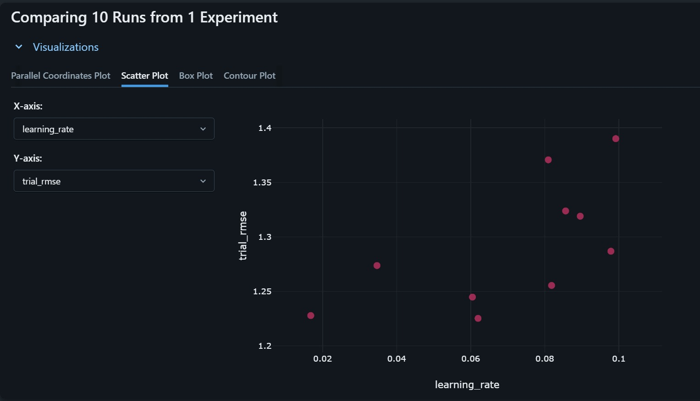
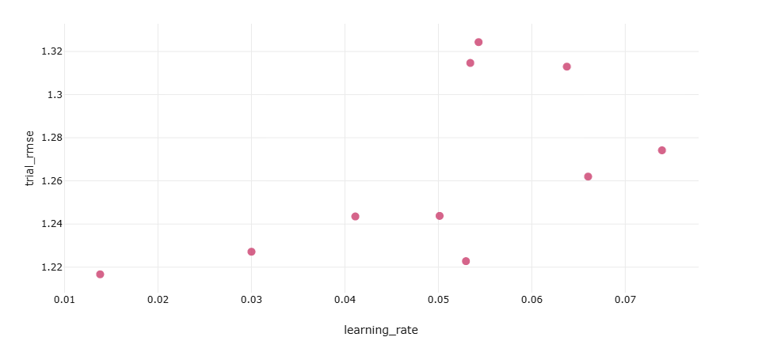

# Demand Forecasting MLOps Pipeline

An end-to-end machine learning and MLOps pipeline for retail demand forecasting using the M5 Forecasting dataset.

The project combines time-series feature engineering, LightGBM forecasting, Optuna hyperparameter optimization, ZenML pipeline orchestration, MLflow experiment tracking, Prometheus monitoring, and Grafana visualization.

---

## Project Overview

Accurate demand forecasting helps retailers improve inventory planning, reduce stock-outs, and support data-driven decision-making.

This project develops a reproducible demand forecasting workflow using historical retail sales data. Instead of treating forecasting as a standalone machine learning task, the project integrates the complete machine learning lifecycle into an MLOps workflow.

### Key Components

- Time-series feature engineering
- LightGBM demand forecasting
- Optuna hyperparameter optimization
- ZenML pipeline orchestration
- MLflow experiment tracking
- Prometheus metric monitoring
- Grafana dashboard visualization
- GitHub version control

---

## Objectives

The main objectives of the project are to:

- Build a machine learning model for retail demand forecasting.
- Generate lag, rolling-statistic, and calendar-based features.
- Optimize LightGBM hyperparameters using Optuna.
- Organize the workflow into reproducible ZenML pipeline steps.
- Track experiments, parameters, and evaluation metrics using MLflow.
- Expose selected forecasting metrics for Prometheus monitoring.
- Visualize model and pipeline metrics using Grafana.
- Maintain a reproducible and version-controlled project structure.

---

## Dataset

The project uses the **M5 Forecasting - Accuracy** dataset, which contains hierarchical daily retail sales data from Walmart.

The forecasting workflow uses selected product/store series from the M5 dataset.

### Dataset files

The following M5 files are required to reproduce the complete workflow:

- `calendar.csv`
- `sales_train_validation.csv`
- `sales_train_evaluation.csv`
- `sell_prices.csv`

The raw datasets are **not included in this GitHub repository** because of their large file sizes.

Place the required CSV files inside:

```text
data/

The forecasting workflow follows a chronological time-series approach:
M5 Retail Sales Data
        |
        v
Data Preparation
        |
        v
Time-Series Feature Engineering
        |
        +-----------------------------+
        |                             |
        v                             v
Lag Features                    Rolling Features
        |                             |
        +-------------+---------------+
                      |
                      v
              LightGBM Forecasting
                      |
                      v
          Optuna Hyperparameter Search
                      |
                      v
               Demand Forecasts
                      |
                      v
             Model Evaluation
              RMSE / MAPE
                      |
                      v
              MLflow Tracking
                      |
                      v
             Metrics Exporter
                      |
                      v
                Prometheus
                      |
                      v
                 Grafana

##Feature Engineering

The feature engineering stage transforms historical demand into predictive time-series features.

Main features
Feature-	Description
lag_1	-       Previous day's sales
lag_7	-       Sales approximately one week earlier
lag_28	-       Sales approximately four weeks earlier
rolling_mean_7- Short-term historical demand
rolling_mean_28-Longer-term demand pattern
day_of_week-    Weekly seasonal pattern
month	-       Monthly temporal pattern
day_number     -Numerical time representation

Rolling statistics are calculated using shifted historical sales to reduce the risk of target leakage.

##Forecasting Model
##LightGBM

The project uses LightGBM (Light Gradient Boosting Machine) as the forecasting model.

LightGBM is a gradient-boosting framework based on decision trees and is well suited to structured and tabular data.

The model learns relationships between historical demand patterns and future demand using the engineered time-series features.

##Evaluation Metrics

The forecasting model is evaluated using:

RMSE — Root Mean Squared Error
MAPE — Mean Absolute Percentage Error

A chronological train/test split is used instead of random shuffling because future observations must not be used to train the model.

##Hyperparameter Optimization

Optuna is used to search for an effective LightGBM hyperparameter configuration.

The optimization workflow:

Define the hyperparameter search space.
Generate a trial.
Train the LightGBM model.
Evaluate the model using RMSE.
Repeat the optimization process.
Select the best-performing configuration.
Use the optimized configuration in the forecasting workflow.

The implemented experiment uses 10 Optuna trials and forecasts 5 selected products. 


##MLOps Architecture
##ZenML

ZenML is used to structure the machine learning workflow into reproducible pipeline steps.
Feature Engineering
        |
        v
Model Training
        |
        v
Forecasting
        |
        v
Evaluation

##MLflow

MLflow is used for experiment tracking.

The workflow records:

Model parameters
Hyperparameters
RMSE
MAPE
Optuna optimization results
Experiment run information

##Prometheus

Prometheus collects selected metrics exposed by the MLflow exporter.

The monitored metrics include:

Forecasting RMSE
Forecasting MAPE
Best Optuna RMSE
Number of Optuna trials
Number of forecasted products

##Grafana

Grafana provides a dashboard for visualizing the forecasting and optimization metrics collected through Prometheus.

##Project structure
demand-forecasting-mlops-pipeline/
│
├── data/
│   └── README.md
│
├── images/
│   ├── Grafana Dashboard.jpeg
│   ├── Optuna_Comparison_Plot.png
│   ├── Promotheus_Metrics.png
│   ├── mlflow1.jpeg
│   ├── mlflow2.jpeg
│   ├── mlflow3.jpeg
│   ├── optuna_trials.jpeg
│   └── zenml.jpeg
│
├── models/
│   └── forecast_model.pkl
│
├── monitoring/
│   ├── mlflow_exporter.py
│   ├── prometheus/
│   └── grafana/
│
├── pipelines/
│   └── forecast_pipeline.py
│
├── steps/
│   ├── feature_engineering.py
│   ├── train_model.py
│   ├── forecast.py
│   └── evaluate.py
│
├── predict_new.py
├── run_pipeline.py
├── third_party_predict.py
├── requirements.txt
├── Demand_Forecasting_MLOps_Report.Rmd
├── Demand_Forecasting_MLOps_Report.pdf
├── .gitignore
├── .gitattributes
└── README.md

##Technologies used 
| Technology | Purpose                               |
| ---------- | ------------------------------------- |
| Python     | Data processing and model development |
| Pandas     | Data manipulation                     |
| NumPy      | Numerical computation                 |
| LightGBM   | Demand forecasting                    |
| Optuna     | Hyperparameter optimization           |
| ZenML      | ML pipeline orchestration             |
| MLflow     | Experiment tracking                   |
| Prometheus | Metric collection                     |
| Grafana    | Monitoring and visualization          |
| Git/GitHub | Version control                       |

# Results & Monitoring

The implemented demand forecasting pipeline was evaluated using RMSE and MAPE. The final documented experiment used 10 Optuna trials to optimize the LightGBM model and generated forecasts for 5 selected products.

## Final Results

| Metric | Result |
|---|---:|
| Products Forecasted | **5** |
| Optuna Trials | **10** |
| RMSE | **1.2253** |
| MAPE | **46.29%** |

The final experiment achieved an **RMSE of 1.2253** and **MAPE of 46.29%**. The optimized LightGBM configuration was selected through Optuna based on forecasting performance.

---

## 1. MLflow Experiment Tracking

MLflow was used to track model experiments, hyperparameters, forecasting metrics, and Optuna trial results.

### MLflow Experiment Runs


### MLflow Metrics


### MLflow Parameters


---

## 2. Optuna Hyperparameter Optimization

Optuna was used to perform hyperparameter optimization for the LightGBM forecasting model.

The experiment used **10 optimization trials**, with each trial evaluated based on RMSE.

### Optuna Trial Results



### Optuna Comparison Plot



---

## 3. ZenML Pipeline Execution

ZenML was used to orchestrate the complete forecasting workflow.

The pipeline consists of four main stages:

```text
Feature Engineering
        ↓
Model Training
        ↓
Forecasting
        ↓
Evaluation
